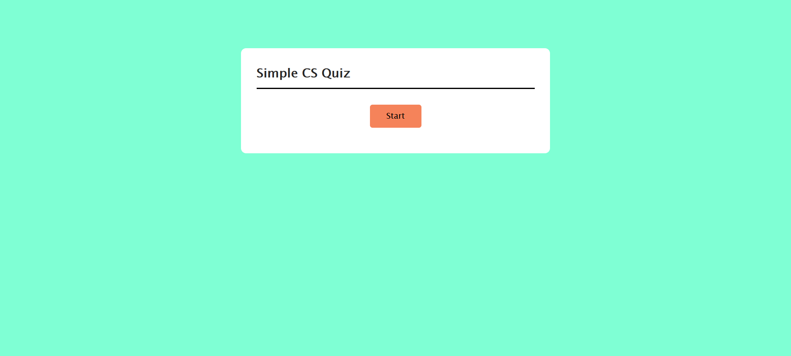
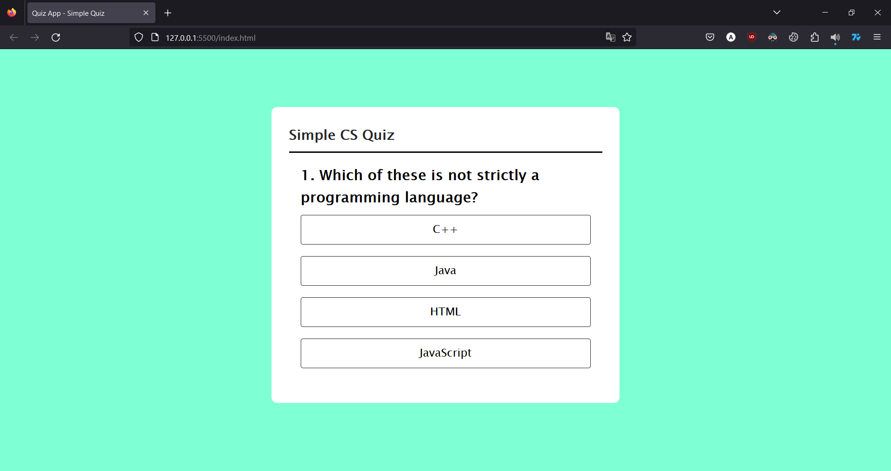
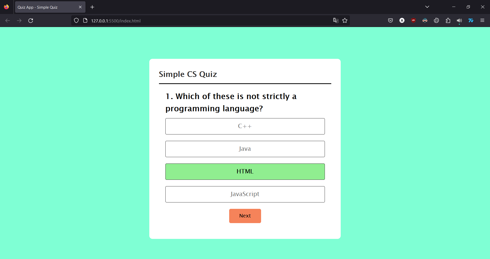
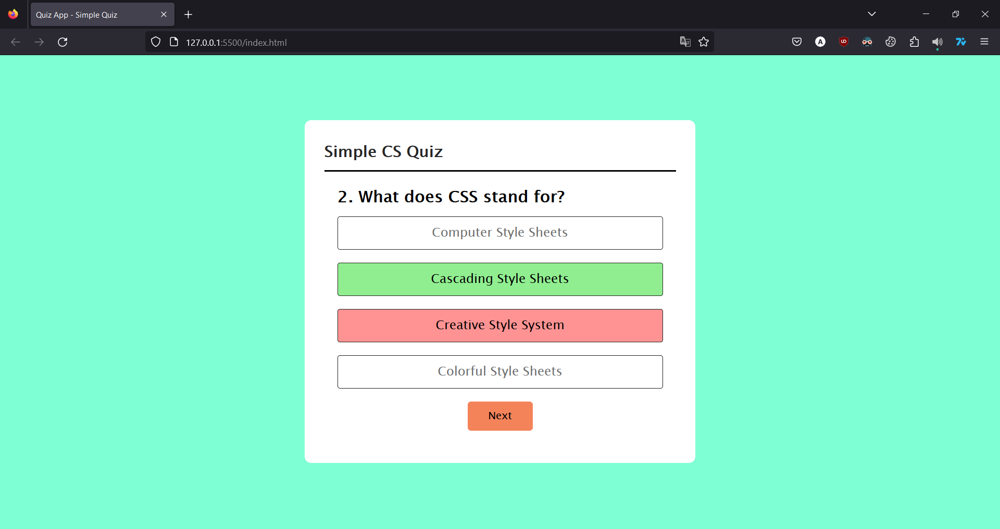
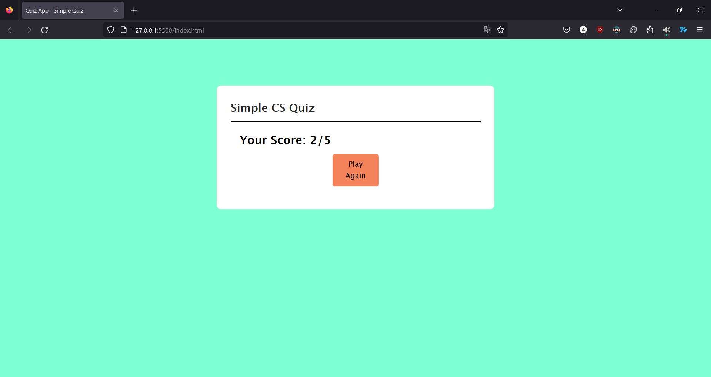

# Simple Frontend Quiz Website Readme

Welcome to the Simple Frontend Quiz Website project! This project was made to practice basic frontend development. This project uses HTML, CSS and vanilla JavaScript

### To Create
1. Clone the repository: `git clone https://github.com/anuraggopalakrishna/small-projects/tree/main/quiz-app`
2. Navigate to the project directory: `cd small-projects\quiz-app`
3. Open the `index.html` file in your web browser.

## Screenshots

Start

Initial State

On selecting right answer

On selecting  wrong answer

Result Page

### To-Do:
* Add a score display while taking the quiz
